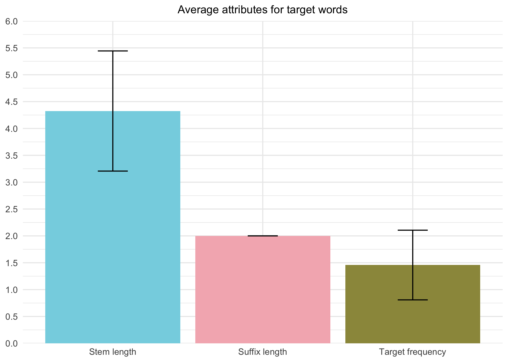

`lme4` is a package in R that provides function for running mixed models, whether it is linear, generalised linear or nonlinear. A model expresses the relationship in a data in terms of a function and, it is “mixed” because it involves both **fixed** and **random** effects.

The idea of mixed models may be understood better when we compare it to the variables present in an ANOVA. Similar to ANOVA, mixed model also involves a dependent variable. Instead of independent variables and error variable, the counterpart in a mixed model would be the fixed effect and random effect respectively.

Being very unfamiliar with mixed models and a first-timer with the package `lme4`, the reason why I decided to do this is because my current honours research involves doing a psycholinguistic experiment. To my knowledge, most data on psycholinguistics, specifically data from DMDX, are now analysed with R. Even though my supervisor advised me that I could go ahead and analyse my data with the traditional ANCOVA analysis, I thought I could give `lme4` a try for this project.

 

## Original proposal

In my project proposal, I mentioned that because finding a recent study on psycholinguistics that did not use `lme4` or related packages was difficult, I decided to analyse data from old papers, specifically one by Rastle, Davis & New (2004) that researched on the underlying mechanisms of processing polymorphemic words. 

Fortunately, I was able to find the [experimental data](https://osf.io/hjuws/), which at first glance looks complete, on Open Science Framework (OSF). I downloaded the files and imported to a new R project.

After hours of reshaping the experimental data, I struggled when I needed to fit the data into a linear mixed model with `lme4`. I realised that the data uploaded on OSF did not include the stimuli properties which were required for the analysis. Thus, because the data were not suitable, I had to find a new data to work with.

 

## Current project

One thing I did not realise was that it takes a lot of time to find a suitable data set that does not analyse its data with `lme4`. Possibly because I was insisting on using psycholinguistic data, and one that I could understand what the research was about. In the end, I decided to use a data that previously analysed with R and try out the codes myself with the data set.

The current [data set](https://osf.io/xtvmz/) I’ve used for this project comes from a study on priming effects of inflectional suffixes by Marjanovič & Crepaldi (2020). In this two-part experiment, participants also completed a masked lexical decision task in Slovenian. For the purpose of this project, I will only be analysing the Experiment 1, where there are two factors (relation and condition), creating 4 different conditions — suffix-priming, suffix-control, stem-priming and stem-control. In the relation factor, primes either share the same stem or suffix with the target (i.e., priming), or not (i.e., control). As with condition factor, primes either shared the same stem (i.e., _**mam**ov-**MAM**AM_) or the same suffix (i.e., _okn**am**-MAM**AM**_). It has been well-established that morphologically related stems do facilitate the response of the target, as it was reported in the study by Rastle, Davis & New (2004), but the aim of this study was to see whether suffixes have the same or even a better facilitation effect.

The analysis of the data involved analysing the inverse-transformed response time (RT) (i.e., -1000/RT), modelled as a function of the two factors and their interaction. The random effects entered to the `lme4` model were the subjects and target words. Along with that, the covariate stem frequency was also included in the model as a fixed effect.

 

## Current analysis

The analysis was then done through the package `lme4` for this project. The full data analysis script of my `lme4` attempt can be accessed [here](lme4.html). 

 

## Results comparison

The descriptive statistics in the paper were presented in a table form. As a person who prefers visual data, I decided to present my descriptive statistics in graph formats (full `ggplot2` script can be accessed [here](ggplot.html)).

### Experiment items descriptive statistics

##### Original experimental items descriptive statistics table

##### Descriptive statistics graphs

 

From the graphs above, we can see that stem and suffix length frequency were matched between related (priming) and unrelated (control) priming condition. However, because of a small discrepancy stem length frequency were not entirely equal across all condition, and thus included as a covariate in the mixed model.

When comparing these graphs to the Average attributes of target words graph above, we see that stem frequency for the prime words are generally longer than suffixes. That is stem related primes are inevitably more similar to the target stem length than suffix related primes. That being said, this is then controlled by the orthographic overlap between the conditions. 

 

The difference in orthographic overlap between stem (.62 − .27 = .35) and suffix (.42 − .13 = .29) conditions are close to similar for both related and unrelated primes.

### Experiment data descriptive statistics

##### Original experimental items descriptive statistics table

##### Descriptive statistics graphs

 

Responses were generally accurate in all four conditions as outliers were excluded from further analysis. 

The results from the linear mixed model analysis suggested a main effect of relation factor (i.e., related prime vs unrelated prime), *F*(1, 2111.2) = 12.19, *p* < 0.001, a main effect of condition factor (i.e., stem vs suffix), *F*(1, 2114.3) = 9.15, *p* = 0.003, but no interaction effect between relation and condition factor, *F*(1, 2110.9) = 2.09, *p* = 0.148. 

 

## Discussion

In Experiment 1, the results showed significant morphological priming when target words are primed with a morphologically related stem (i.e. _**mam**ov-**MAM**AM_), as compared to when it is primed with a morphologically unrelated nonword (i.e., nonword primes that did not share any orthography or morphology overlap with the target; Marjanovič & Crepaldi, 2020). This result is well established from multiple studies including those by Rastle, Davis, & New (2004).

As with suffix priming, data seems to be unclear as compared to those of stem priming. While the magnitude of the difference between priming and control condition when the prime and the target shared the same suffix is way smaller (i.e., 738.17-724.37 = 13.8ms) than those of stem condition (i.e., 709.84-687.94 = 21.9ms), the interaction between relation and condition is not significant which suggests that suffix priming and stem priming are not significantly different (Marjanovič & Crepaldi, 2020). Thus, this is further analysed in Experiment 2 of the paper.

 

## Conclusion

Overall, even though I did not manage to analyse the data with `lme4` without the help of the original script, I am glad that I at least tried it out. I realised that there is so much to learn, not only with the package itself, but  the concept of linear mixed effects model as well. 

With this project, apart from trying the `lme4` package, I also managed to experiment more with RMarkdown, `ggplot2`, `dplyr`, as well as trying other different packages from `car` to `reshape2`.  

