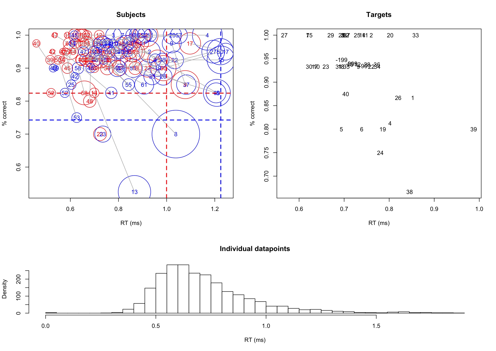
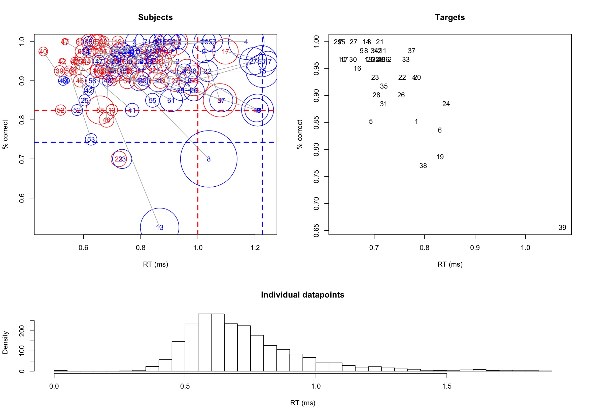

```{r setup, include=FALSE}
knitr::opts_chunk$set(echo = TRUE) 
library(tidyverse)
library(dplyr)
library(lme4)
library(lmerTest)
library(car)
```


### Loading data

```{r loaddata}
expdata <- read.csv(file = "Data_Experiment1.csv", head = TRUE, sep = ",")
glimpse(expdata)

stimuli <- read.csv(file = "StimuliProperties_Experiment1.csv", head = TRUE, sep = ",")
glimpse(stimuli)
```

### Analysis of experimental items

#### Mutating and formatting variables
```{r newvariables, results= 'hide'}
#create new condition variable
stimuli <- mutate(stimuli,
  condition =
    ifelse(stimuli$primingMorpheme == 'suffix' 
           & stimuli$relatedness == 'rel', "suffix_priming",
           ifelse(stimuli$primingMorpheme == 'suffix'
                  & stimuli$relatedness == 'cntr', "suffix_control",
                  ifelse(stimuli$primingMorpheme == 'stem'
                         & stimuli$relatedness == 'rel', "stem_priming",
                         ifelse(stimuli$primingMorpheme == 'stem'
                                & stimuli$relatedness == 'cntr', "stem_control",
                                "NULL")))))
#convert new variable as factor and numerical
stimuli$condition <- factor(stimuli$condition);
stimuli$primeFreq <- as.double(stimuli$primeFreq);

#new variable on stem and target length
stimuli$primeStemLength <- stimuli$PrimeLength-stimuli$primeSuffixLength;
stimuli$targetStemLength <- stimuli$targetLength-stimuli$targetSuffixLength
```

```{r glimpse1}
glimpse(stimuli)
```

#### Calculating attributes of stimuli 
```{r mean}
#target stem length attributes
aggregate(targetStemLength ~ condition, FUN=mean, data=stimuli);
aggregate(targetStemLength~ condition, FUN=sd, data = stimuli);

#prime stem length attributes
aggregate(primeStemLength ~ condition, FUN=mean, data=stimuli);
aggregate(primeStemLength~ condition, FUN=sd, data = stimuli);

#target suffix length attributes
aggregate(targetSuffixLength ~ condition, FUN=mean, data=stimuli);
aggregate(targetSuffixLength~ condition, FUN=sd, data = stimuli);

#prime suffix length attributes
aggregate(primeSuffixLength ~ condition, FUN=mean, data=stimuli);
aggregate(primeSuffixLength~ condition, FUN=sd, data = stimuli);

#target freq
aggregate(log10(targetFreq) ~ condition, FUN=mean, data=stimuli);
aggregate(log10(targetFreq) ~ condition, FUN=sd, data = stimuli);

#prime freq
aggregate(log10(primeFreq) ~ condition, FUN=mean, data=stimuli);
aggregate(log10(primeFreq) ~ condition, FUN=sd, data = stimuli);

#orthography overlap
aggregate(orthOverlap ~ condition, FUN=mean, data=stimuli);
aggregate(orthOverlap~ condition, FUN=sd, data = stimuli)
```

### Analysis of data

#### Mutating and formatting variables

```{r newvariable, results = 'hide'}
#create new variable for target
expdata <- mutate(expdata,
  target =
    ifelse(expdata$TrialID>199 & expdata$TrialID<299, 
           (expdata$TrialID>199 & expdata$TrialID<299)-100,
           ifelse(expdata$TrialID>299 & expdata$TrialID<399, 
                  (expdata$TrialID>299 & expdata$TrialID<399)-200,
                  ifelse(expdata$TrialID>399 & expdata$TrialID<499, 
                         (expdata$TrialID>399 & expdata$TrialID<499)-300,
                         expdata$TrialID-100))))

#convert variable to factor
expdata$target <- factor(expdata$target);
expdata$SubjectID <- factor(expdata$SubjectID)

#create new variable for condition
expdata <- mutate(expdata,
  cond =
    ifelse(expdata$Condition == 'suffix_priming', 
           'suffix',
           ifelse(expdata$Condition == 'suffix_control', 
                  'suffix',
                  ifelse(expdata$Condition == 'nonword', 
                         NA,
                         ifelse(expdata$Condition == 'stem_control',
                                'stem',
                                'stem')))))

#create new variable for relation
expdata <- mutate(expdata,
  relation =
    ifelse(expdata$Condition == 'suffix_priming', 
           'prime',
           ifelse(expdata$Condition == 'suffix_control', 
                  'control',
                  ifelse(expdata$Condition == 'nonword', 
                         NA,
                         ifelse(expdata$Condition == 'stem_control',
                                'control',
                                'prime')))))

# convert new variables to factors
expdata$relation <- factor(expdata$relation); 
expdata$cond <- factor(expdata$cond)

#create word conditon variable
expdata <- mutate(expdata,
  category =
    ifelse(expdata$Condition == 'nonword', 
           'nonword',
           'word'))

#convert as factor
expdata$category = factor(expdata$category)

```

```{r glimspe2}
glimpse(expdata)
```
#### Checking and handling outliers

A [separate script](diagf.rmd) was used to graph and identify any outliers present in the data.

```{r outliers}
source("diagf.R");
diagnostics.f(expdata$RT, expdata$Accuracy, expdata$SubjectID, expdata$target, expdata$category , "outliers")
```


```{r outlierhandling}
expdata_2 <- subset(expdata, Condition != 'nonword' & SubjectID != '13' & target != '39' & RT>0);
summary(expdata_2)
```
#### Experimental data descriptive statistics

Before proceeding with `lme4`, here are the descriptive statistics (mean RT and accuracy) for four of the different conditions. 

```{r datadesc}
#convert RT to ms
expdata_2 <- mutate(expdata_2,
  RTms =
    1000*expdata_2$RT)

#descriptive stats for experiment data
aggregate(RTms ~ Condition, FUN=mean, data=expdata_2); 
aggregate(RTms ~ Condition, FUN=sd, data = expdata_2);
aggregate(Accuracy ~ Condition, FUN=mean, data=expdata_2);
aggregate(Accuracy ~ Condition, FUN=sd, data=expdata_2);
```
#### lme4 trial

After modifying the dataset, it is time to attempt on `lme4`. As a first-timer in `lme4`, it is great that I have the analysis and results from the paper where the data is from, to compare and see whether my analysis is correct.

##### Trial 1

Before I begin my first `lme4` attempt, I watched a [tutorial](https://youtu.be/9BDA5b-gtbc) on linear mixed effects model and coding the model with the `lme4` package on R. With the video, I understood that the model is called *mixed effects* because of the inclusion of **fixed** and **random** effects. Comparing a linear mixed effect model (lme) to ANOVA, fixed effects and random effects in lme can be thought of as the independent variable and error variable in ANOVA respectively.

In my first trial of `lme4`, I read through the research paper to understand what analysis was done and what was entered into the lme model as fixed and random effects. As stated under the data analysis section, inverse-transformed (i.e., -1000/RT) RT was analysed with relation, condition, and their interaction as fixed effects, with subject and target words as random effects (Marjanovic & Crepaldi, 2020). In terms of covariates, stem frequency was included as a fixed effect.

Thus, I entered those values into three different models (i.e., relation, condition, and relation*condition). Along with that, instead of analysing accuracy of responses like the paper did, I wanted to calculate the error rates and analyse it with `glmer` instead.

```{r lmevariable}

expdata_2 <- mutate(expdata_2,
  error =
    ifelse(expdata_2$Accuracy == 1, 
           0,
           1))

expdata_2 <- mutate(expdata_2,
  invcrt =
    -1000/expdata_2$RTms)

all <- merge(expdata_2, stimuli, by.x = 'TrialID', by.y = 'TrialID')
```

```{r lmeglme, results= 'hide', message= FALSE, warning= FALSE}
relation_glmer <- glmer(error ~ relation+primeFreq+(1|target.x)+(1|SubjectID), data = all, family = binomial)
condition_glmer <- glmer(error ~ cond+primeFreq+(1|target.x)+(1|SubjectID), data = all, family = binomial)
int_glmer <- glmer(error ~ relation*cond+primeFreq+(1|target.x)+(1|SubjectID), data = all, family = binomial)

relation_lmer <- lmer(invcrt ~ relation+primeFreq+(1|target.x)+(1|SubjectID), data = all)
condition_lmer <- lmer(invcrt ~ cond+primeFreq+(1|target.x)+(1|SubjectID), data = all)
int_lmer <- lmer(error ~ relation*cond+primeFreq+(1|target.x)+(1|SubjectID), data = all)
```

```{r lmeglmer}
summary(int_lmer)
anova(int_lmer)
```

From this analysis, my `glmer` returned a <span style="color: red;">boundary (singular) fit: see ?isSingular</span> error. After googling what it meant, it seems as though singular fit may be because of either collinearity in fixed effects or that a random effect variance is very near zero. Perhaps my idea of analysing error may not be appropriate for this data set? Or perhaps I may be over challenging myself as a first-timer.

Running an anova analysis on the interaction lme model, it automatically runs it with Satterthwaite's method where degrees of freedom is calculated bassed on Satterthwaite's approximation. Looking at the analysis, I realise three things. First, my values are so different from what was reported in the paper (shown below). Second, the values reported in the paper may be there in the analysis result, but perhaps I am not reading the analysis right. Lastly, it is also possible that my codes are wrong.

I decided to perform an anova analysis from the lme4 package itself and see how the results differ.

```{r anovalme}
anova(int_lmer, ddf = "lme4")
```

Once again, the results are super different from the ones in the paper.

##### Trial 2

In the next trial, I thought perhaps if we entered the covariate in log form and centered according to their respective means and SD it may work. I came to this decision after going through other data uploaded on the Open Science Framework [website](https://osf.io/), and one analysis on psycholinguistics data using `lme4` entered the covariates in logs form.

At this point, I am only trying the interaction effect and putting the error rates aside for the moment.

Firstly, I tried the log values.

```{r lmelog}
all2 <- mutate(all,logprfq = log10(primeFreq))

int_lmer_log <- lmer(invcrt ~ relation*cond + logprfq + (1|target.x) + (1|SubjectID), data = all2)
summary(int_lmer_log)
anova(int_lmer_log)
anova(int_lmer_log, ddf = "lme4")
```

Again, neither the relation or condition effects are significant.

Next I tried whether it will work if it is centered according to their respective means (*I don't think it will, but no harm in trying*).

```{r lmelogz}
all2 <- mutate(all2, cov = ifelse(all2$Condition == 'stem_priming',
                                      ((all2$logprfq-1.4575912)/0.6488540),
                                      ifelse(all2$Condition == 'stem_control',
                                             ((all2$logprfq-0.9695187)/0.8196274),
                                             ((all2$logprfq-1.2968365)/0.8059078))))

int_lmer_cov <- lmer(invcrt ~ relation*cond + cov + (1|target.x) + (1|SubjectID), data = all2)

summary(int_lmer_cov)
anova(int_lmer_cov)
anova(int_lmer_cov, ddf = "lme4")
```

As expected, results still aren't right. 

##### Trial 3

In this trial, I checked the [original script](https://osf.io/7t2d3/) posted on Open Science Framework and the authors did specify a reference level and create a subset of only data with the correct response. I've looked up what `relevel` does and it seems as if it is ordering the data in terms of the reference level. Not sure how this would make any difference in the analysis, but again, it is worth trying it out.

```{r relevel}
true <- subset(all, Accuracy == 1)
true$relation <- relevel(true$relation, 'control');
true$cond <- relevel(true$cond, 'stem')

int_lmer_lvl <- lmer(invcrt ~ relation*cond + primeFreq + (1|target.x) + (1|SubjectID), data = true)

summary(int_lmer_lvl)
anova(int_lmer_lvl)
anova(int_lmer_lvl, ddf = "lme4")
```

##### Trial 4

After hours of reading through forums and papers, I realised that perhaps p-values aren't as straightforward when analysing with `lme4`. One way to attain p-values with `lme4` is through comparing models and paying attention to the Likelihood Ratio Test ( [Winter, 2015](references.html) ). With main effects, a null model (i.e., without factors that I am interested in) should be created. In my case, it would be a model with the covariate.

```{r nullmodel, results= 'hide'}
null <- lmer(invcrt ~ primeFreq + (1|target.x) + (1|SubjectID), data = all, REML = FALSE)
```

Then, the model with the factor that I am interested in. This time I tried the condtion factor. I did not analyse interaction here because it needs to be compared with a different null, which I did later on.

```{r condmodel, results= 'hide', warning= FALSE, message= FALSE}
cond_lmer <- lmer(invcrt ~ cond+primeFreq+(1|target.x)+(1|SubjectID), data = all, REML = FALSE)
```
Next, we compare both models using `anova`

```{r compare}
anova(null, cond_lmer)
```

Chi Square p-values are not significant. Next I tried to do the same with the relation main effect. 

```{r relmodel, results= 'hide', warning= FALSE, message= FALSE}
relation_lmer <- lmer(invcrt ~ relation+primeFreq+(1|target.x)+(1|SubjectID), data = all, REML = FALSE)
anova(null, cond_lmer)
```
Both yielded results that were not significant which were significant in the paper. However, before I move on to the next trial, I tried to analyse the interaction to see whether this method could give me similar results as what was reported in the paper.

With comparing interaction, the interaction model should be compared to the model that includes both factors.

```{r compareint}
null_int <- lmer(invcrt ~ cond + relation + primeFreq + (1|target.x) + (1|SubjectID), data = all, REML = FALSE)
int_lmer <- lmer(invcrt ~ cond*relation + primeFreq + (1|target.x) + (1|SubjectID), data = all, REML = FALSE)
anova(null_int, int_lmer)
```

Results still aren't right. Along with that, I am pretty unfamiliar with Chi Square Tests as I've never done it before. I wasn't sure what was wrong. Is it because of my `lme4` codes? Or is it because my data set is wrong entirely. Hence, in the next trial I decided to start afresh and code a new script based on the original script and see if I can get the same results as reported in the paper.

##### Trial 5

```{r oriscript1}
#create new environment
stim <- read.csv(file = "StimuliProperties_Experiment1.csv", head = TRUE, sep = ",")
summary(stim)
```

```{r oriscript2}
#create variables
stim <- mutate(stim,
  condition =
    ifelse(stim$primingMorpheme == 'suffix' 
           & stim$relatedness == 'rel', "suffix_priming",
           ifelse(stim$primingMorpheme == 'suffix'
                  & stim$relatedness == 'cntr', "suffix_control",
                  ifelse(stim$primingMorpheme == 'stem'
                         & stim$relatedness == 'rel', "stem_priming",
                         ifelse(stim$primingMorpheme == 'stem'
                                & stim$relatedness == 'cntr', "stem_control",
                                "NULL")))))
stim$condition <- factor(stim$condition);
stim$primeFreq <- as.double(stim$primeFreq);
stim$primeStemLength <- stim$PrimeLength-stim$primeSuffixLength;
stim$targetStemLength <- stim$targetLength-stim$targetSuffixLength;
```

```{r oriscript3}
#descriptive stats
aggregate(targetStemLength ~ condition, FUN=mean, data=stim);
aggregate(targetStemLength~ condition, FUN=sd, data = stim);

aggregate(primeStemLength ~ condition, FUN=mean, data=stim);
aggregate(primeStemLength~ condition, FUN=sd, data = stim);

aggregate(targetSuffixLength ~ condition, FUN=mean, data=stim);
aggregate(targetSuffixLength~ condition, FUN=sd, data = stim);

aggregate(primeSuffixLength ~ condition, FUN=mean, data=stim);
aggregate(primeSuffixLength~ condition, FUN=sd, data = stim);

aggregate(log10(targetFreq) ~ condition, FUN=mean, data=stim);
aggregate(log10(targetFreq) ~ condition, FUN=sd, data = stim);

aggregate(log10(primeFreq) ~ condition, FUN=mean, data=stim);
aggregate(log10(primeFreq) ~ condition, FUN=sd, data = stim);

aggregate(orthOverlap ~ condition, FUN=mean, data=stim);
aggregate(orthOverlap~ condition, FUN=sd, data = stim);

```

```{r oriscript4}
#create new environment
data <- read.csv(file = "Data_Experiment1.csv", head = TRUE, sep = ",")
summary(data)
```

```{r oriscript5}
#create variables
data <- mutate(data,
  target =
    ifelse(data$TrialID>199 & data$TrialID<299, 
           (data$TrialID>199 & data$TrialID<299)-100,
           ifelse(data$TrialID>299 & data$TrialID<399, 
                  (data$TrialID>299 & data$TrialID<399)-200,
                  ifelse(data$TrialID>399 & data$TrialID<499, 
                         (data$TrialID>399 & data$TrialID<499)-300,
                         data$TrialID-100))));

data$target <- factor(data$target);
data$SubjectID <- factor(data$SubjectID);


data <- mutate(data,
  cond =
    ifelse(data$Condition == 'suffix_priming', 
           'suffix',
           ifelse(data$Condition == 'suffix_control', 
                  'suffix',
                  ifelse(data$Condition == 'nonword', 
                         NA,
                         ifelse(data$Condition == 'stem_control',
                                'stem',
                                'stem')))))

data <- mutate(data,
  relation =
    ifelse(data$Condition == 'suffix_priming', 
           'prime',
           ifelse(data$Condition == 'suffix_control', 
                  'control',
                  ifelse(data$Condition == 'nonword', 
                         NA,
                         ifelse(data$Condition == 'stem_control',
                                'control',
                                'prime')))));

# convert the new variables to factors
data$relation <- factor(data$relation); 
data$cond <- factor(data$cond);

data <- mutate(data,
  lexicality =
    ifelse(data$Condition == 'nonword', 
           'nonword',
           'word'));

data$lexicality = factor(data$lexicality)
```

So far, everything is exactly what I coded previously (only with different environment name).

```{r oriscript6, results= 'hide'}
#checking for outliers again
source("diagf.R");
diagnostics.f(data$RT, data$Accuracy, data$SubjectID, data$target, data$lexicality , "OutliersCheck");
hist(data$RT[data$RT<.500 & data$Accuracy==1], breaks=seq(0,.500,.050));
hist(data$RT[data$RT>1.3 & data$Accuracy==1], breaks=seq(1.3,2,.05))
```



Next, is cleaning up the data. One step that I did differently, or at least in different sequence than the researcher. I, for one thing, did not create two subset, but one.

```{r oriscript7}
#clean data
dataAcc <- subset(data, Condition != 'nonword' & SubjectID != '13' & target != '39' & RT>0);
summary(dataAcc);
dataRt <- subset(dataAcc, Accuracy == 1); 
summary(dataRt);
```

```{r oriscript8}
#convert s to ms on the RT
dataRt$RTms <- 1000*dataRt$RT;

#descriptive stats
aggregate(RTms ~ Condition, FUN=mean, data=dataRt); 
aggregate(RTms ~ Condition, FUN=sd, data = dataRt);
#checking medians too, RTs are quite long:
aggregate(RTms ~ Condition, FUN=median, data=dataRt); 
aggregate(RTms ~ Condition, FUN=IQR, data=dataRt); 
#descriptive stats
aggregate(Accuracy ~ Condition, FUN=mean, data=dataAcc);
aggregate(Accuracy ~ Condition, FUN=sd, data=dataAcc);
```
Similar descriptive statistics for the experimental data.

Now to run the lme model. The researcher used `car` package to perform ANOVA, which was loaded in the beginning. Also, as I've mentioned previously, the researcher used `relevel` to set a reference level prior to the analysis at this stage.

```{r oriscript9}
#merge data and stimuli properties 
dataRt <- merge(dataRt, stim, by.x='TrialID', by.y='TrialID');

# run the model
dataRt$relation <- relevel(dataRt$relation, 'control');
dataRt$cond <- relevel(dataRt$cond, 'stem');
modelRT <- lmer(-1000/RTms ~  relation * cond + primeFreq + (1| SubjectID) + (1| target.x ), data=dataRt,  REML=T);
summary(modelRT);
Anova(modelRT, type=3, test.statistic='F')
```

The next script, the researcher analysed the differences from the outputs, if outliers were excluded from the analysis. However, I decided to not run the remaining script. Prior to this trial, I have copied the exact script with the exact format into a new RSTudio window. I ran the script and results were exactly right and were the values reported on the paper. As the previous `Anova` analysis did not yield the same results, I decided to terminate this trial.
```{r oriscript9.2, results= 'hide'}
# run the model without the outliers terminated
modelRTb <- lmer(-1000/RTms ~  relation * cond+ primeFreq  + (1| SubjectID) + (1| target.x ), data=subset(dataRt, abs(scale(resid(modelRT)))<2.5),  REML=T);
summary(modelRTb)
```

##### Trial 6

At this point, I am lost and frustrated as I do not know what have I done wrong. One major difference between my script and the original script is the way in which new variables were created. In my script, I have used `mutate` and `ifelse` functions, whereas the original script created new variables in a different way. I do not know if this makes any difference and whether it will affect the analysis, but I couldn't think of anything else that I did differently to the original code in **Trial 5**.

Hence, being really lost, in this trial, I am very sad (*really sad*) to say that I will use the *exact copy* of the original script to conduct the analysis.

```{r superoriginal, results= 'hide'}
#import libraries
library(lmerTest); #for linear mixed modeling
library(effects); #for plotting the output of the mixed models and compute effect size
library(ggplot2); #for generic plotting
library(dplyr);  #for plotting the distributions per subject
library(car); #for running Anova
invF <- function(x) -1000/x; #for back transforming effects to ms

#import stimuli features file
stim1 <- read.csv(file = "StimuliProperties_Experiment1.csv", head = TRUE, sep = ",")
summary(stim1);
#create variable condition
stim1$condition <- 'condition';
stim1$condition[stim1$primingMorpheme == 'suffix' & stim1$relatedness == 'rel'] <- 'suffix_priming'
stim1$condition[stim1$primingMorpheme == 'suffix' & stim1$relatedness == 'cntr'] <- 'suffix_control'
stim1$condition[stim1$primingMorpheme == 'stem' & stim1$relatedness == 'rel'] <- 'stem_priming'
stim1$condition[stim1$primingMorpheme == 'stem' & stim1$relatedness == 'cntr'] <- 'stem_control'
stim1$condition <- factor(stim1$condition);
stim1$primeFreq <-as.double(stim1$primeFreq);
stim1$primeStemLength <- stim1$PrimeLength-stim1$primeSuffixLength;
stim1$targetStemLength <- stim1$targetLength-stim1$targetSuffixLength;
```

```{r superoriginal2}
#descriptive stats
tstem_mean <- aggregate(targetStemLength ~ condition, FUN=mean, data=stim1);
tstem_sd <- aggregate(targetStemLength~ condition, FUN=sd, data = stim1);

prstem_mean <- aggregate(primeStemLength ~ condition, FUN=mean, data=stim1);
prstem_sd <- aggregate(primeStemLength~ condition, FUN=sd, data = stim1);

tsuffix_mean <- aggregate(targetSuffixLength ~ condition, FUN=mean, data=stim1);
tsuffix_sd <- aggregate(targetSuffixLength~ condition, FUN=sd, data = stim1);

prsuffix_mean <- aggregate(primeSuffixLength ~ condition, FUN=mean, data=stim1);
prsuffix_sd <- aggregate(primeSuffixLength~ condition, FUN=sd, data = stim1);

tfq_mean <- aggregate(log10(targetFreq) ~ condition, FUN=mean, data=stim1);
tfq_sd <- aggregate(log10(targetFreq) ~ condition, FUN=sd, data = stim1);

prfq_mean <- aggregate(log10(primeFreq) ~ condition, FUN=mean, data=stim1);
prfq_sd <- aggregate(log10(primeFreq) ~ condition, FUN=sd, data = stim1);

orth_mean <- aggregate(orthOverlap ~ condition, FUN=mean, data=stim1);
orth_sd <- aggregate(orthOverlap~ condition, FUN=sd, data = stim1)

print(tstem_mean)
print(tstem_sd)
print(prstem_mean)
print(prstem_sd)
print(tsuffix_mean)
print(tsuffix_sd)
print(prsuffix_mean)
print(prsuffix_sd)
print(prfq_mean)
print(prfq_sd)
print(tfq_mean)
print(tfq_sd)
print(orth_mean)
print(orth_sd)
#this feels repetitive, wonder if there's a better way to print multiple data at once
```

Descriptive statistics for the stimuli looks okay.

```{r superoriginal3, results= 'hide'}
#read the data file
read.csv(file = "Data_Experiment1.csv", head = TRUE, sep = ",") -> data1;
summary(data1);
#create a variable for target word
data1$target <- data1$TrialID-100;
data1$target[data1$TrialID>199 & data1$TrialID<299] <- data1$target[data1$TrialID>199 & data1$TrialID<299]-100;
data1$target[data1$TrialID>299 & data1$TrialID<399] <- data1$target[data1$TrialID>299 & data1$TrialID<399]-200;
data1$target[data1$TrialID>399 & data1$TrialID<499] <- data1$target[data1$TrialID>399 & data1$TrialID<499]-300;

#factor sbj and items
data1$target <- factor(data1$target);
data1$SubjectID <- factor(data1$SubjectID);

#create new variables "cond": suffix/stem and "relation": control/prime
data1$cond <- 'stem';
data1$cond[data1$Condition == 'suffix_priming'] <- 'suffix';
data1$cond[data1$Condition == 'suffix_control'] <- 'suffix';
data1$cond[data1$Condition == 'nonword'] <- NA;
data1$relation<- 'control';
data1$relation[data1$Condition == 'suffix_priming'] <- 'prime';
data1$relation[data1$Condition == 'stem_priming'] <- 'prime';
data1$relation[data1$Condition == 'nonword'] <- NA;
# convert the new variables to factors
data1$relation <- factor(data1$relation); 
data1$cond <- factor(data1$cond); 
```

```{r superoriginal4, results= 'hide'}
## run the diagnostics, to check for outliers in subjects and items based on RT and accuracy
data1$lexicality = "word"
data1$lexicality[data1$Condition == 'nonword'] <- 'nonword'
data1$lexicality = factor(data1$lexicality)

source("diagf.R");
diagnostics.f(data1$RT, data1$Accuracy, data1$SubjectID, data1$target, data1$lexicality , "OutliersCheck2");
#we will omit subject 13, and target word 39 from further analysis
hist(data1$RT[data1$RT<.500 & data1$Accuracy==1], breaks=seq(0,.500,.050)); 
hist(data1$RT[data1$RT>1.3 & data1$Accuracy==1], breaks=seq(1.3,2,.05))
```




```{r superoriginal5, results= 'hide'}
#clean data to keep only acual words, omit the wrong trials and trials without response
data1Acc <- subset(data1, Condition != 'nonword' & SubjectID != '13' & target != '39' & RT>0);
summary(data1Acc);
data1Rt <- subset(data1Acc, Accuracy == 1); 
summary(data1Rt);

#convert s to ms on the RT
data1Rt$RTms <- 1000*data1Rt$RT;
```

```{r superoriginal6}
#descriptive stats
data_mean <- aggregate(RTms ~ Condition, FUN=mean, data=data1Rt); 
data_sd <- aggregate(RTms ~ Condition, FUN=sd, data = data1Rt);
#checking medians too, RTs are quite long:
aggregate(RTms ~ Condition, FUN=median, data=data1Rt); 
aggregate(RTms ~ Condition, FUN=IQR, data=data1Rt); 
#descriptive stats
acc_mean <- aggregate(Accuracy ~ Condition, FUN=mean, data=data1Acc);
acc_sd <- aggregate(Accuracy ~ Condition, FUN=sd, data=data1Acc)

print(data_mean)
print(data_sd)
print(acc_mean)
print(acc_sd)
```

So far so good.

```{r superoriginal7}
#merge data and stimuli properties 
data1Rt <- merge(data1Rt, stim1, by.x='TrialID', by.y='TrialID');

# run the model
data1Rt$relation <- relevel(data1Rt$relation, 'control');
data1Rt$cond <- relevel(data1Rt$cond, 'stem');
model1RT <- lmer(-1000/RTms ~  relation * cond + primeFreq + (1| SubjectID) + (1| target.x ), data=data1Rt,  REML=T);
summary(model1RT);
Anova(model1RT, type=3, test.statistic='F')
```

Not sure if I should be happy but this yielded results that were reported on the paper (see below). Both relation and condition effects are significant with p-values < 0.001 and = 0.002 respectively. F values also match those reported. The interaction is also not significant with p-values of 0.15, as reported in the paper.

When reference level was set to suffix, results were also exactly what was reported.
```{r superoriginal9}
###set reference level to suffix
data1Rt$cond <- relevel(data1Rt$cond, 'suffix');
model1RTsuf <- lmer(-1000/RTms ~  relation * cond + primeFreq + (1| SubjectID) + (1| target.x ), data=data1Rt,  REML=T);
summary(model1RTsuf);
Anova(model1RTsuf, type=3, test.statistic='F')
```
As mentioned in the paper, when reference level was set to suffix, the relation effect becomes not significant. To read my full discussion on this analysis, please refer to the home page [here](file.html).


### Remarks on my attempt with lme4

After several days and 6 trials with analysing a data with `lme4`, I realised that this is a very complicated package to use and understand. My mind is tired, confused, frustrated that I had to end up using the original script to attain the results. There is so much for me to learn with `lme4`, and I believe that starting from the bottom, the very beginning in understanding the concept of linear mixed model would be the best choice.

Now moving on to [plotting](ggplot.html) the results to tables and graphs.


<style>

h1.title {
  font-size: 32px;
  color: slategrey;
}

h3 {
  font-size: 25px;
  color: grey;
}

h4 {
  font-size: 20px;
  color: darkgrey;
}

p {color: royalblue}

h5 {
    font-size: 15px;
    color: darkslategrey;
}
</style>